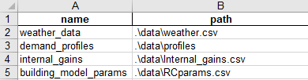
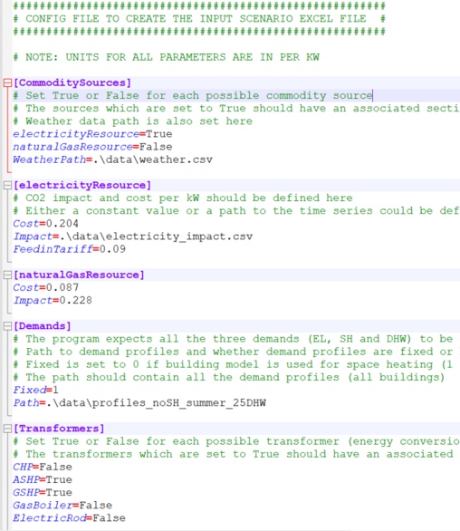

.. _defining_an_energy_network:

Defining an energy network
==========================

An energy network can be defined as an object of the EnergyNetworkIndiv class or the EnergyNetworkGroup class. This
object then acts as the primary container for the model. An energy network is grouped into buildings, each building would
then contain the definition of components such as sources, sinks, transformers, and buses (the connections between
different components). These components, and their respective parameters, are defined in an excel file which is provided
as an input. A description on how to prepare the excel file is provided in the next sections.

EnergyNetworkClass
------------------
The EnergyNetworkClass is the main parent class, from which two child classes EnergyNetworkIndiv and EnergyNetworkGroup
are inherited. Either EnergyNetworkIndiv class or EnergyNetworkGroup class could be used to define an energy network.
The choice mainly depends on whether the buildings are linked together (electrically and/or thermally) or not.

If the buildings within an energy network do not share electricity and/or heat, EnergyNetworkIndiv class is used::

    import EnergyNetworkIndiv
    network = EnergyNetworkIndiv(dateTimeIndex)

Otherwise, if the buildings are expected to share energy (electrical and/or heat), EnergyNetworkGroup class is used::

    import EnergyNetworkGroup
    network = EnergyNetworkGroup(dateTimeIndex)

The parameter to be passed in both the cases is a Datetime index. This parameter gives the time range for an
optimization model. The Datetime index could be defined using date_range() in pandas::

    import pandas as pd
    dateTimeIndex = pd.date_range('2021-01-01 00:00:00', '2021-12-31 23:00:00', freq="60min")

The scenario consisting of the energy network (including buildings and links, if any) to be optimized can be defined using either a configuration (or config) file or an excel file. The input config/excel file define the available energy conversion and storage technologies. The associated parameters and sizing limits of the technologies are also defined within the input scenario file, along with the cost and environmental impact assumptions per technology, a path to the demand profiles and weather data files. The purchased electricity cost as well as the emissions of the grid electricity can either be a time series or a constant value. The demand profiles for space heating can be defined statically or alternatively by means of a dynamic linear building model. After preparing the config/excel file, an energy network can be defined in a Python script for optimization.

Descriptions of input excel/config files are given next.

Input Excel File
----------------
Once the ``network`` object has been created, a model can be built from an input excel file which
defines different components which constitute the model, how they are connected and their associated parameters::

    network.setFromExcel(inputExcelFilePath, numberOfBuildings, clusterSize, opt, mergeLinkBuses, dispatchMode)

``inputExcelFilePath`` gives the path of the excel input file. ``numberofBuildings`` is an integer parameter specifying the
number of buildings defined in the excel file. The last two parameters clusterSize and opt are optional. The ``opt``
parameter could be either ``'costs'`` (default value) or ``'env'`` depending on which criteria should be optimized. The ``mergeLinkBuses`` parameter is an optional argument wether or not to use the merge of the different buses (set as False if not given). The ``dispatchMode`` parameter is an optional argument wether or not to activate the dispatch optimization (set to False if not given). The
``clusterSize`` parameter is used to provide a selected number of days which could be assumed representative of the entire
time range. For example: two typical days could be selected to model the entire year, which could represent two clusters
summer and winter. This would improve the optimization speed. If not given during the function call, the default value
of the clusterSize parameter assumes no day clusters. This parameter is described further in
:ref:`advanced_under_development_features`

The input excel file is used to define an optimization model and set the model parameters. Each sheet of this excel file
is structured to defin different components, such as buses, storages and transformers, their respective parameters,
connections between these components and the building to which they belong.

.. image:: ./resources/input_excel_info.PNG
      :width: 800
      :alt: input_excel_info

A sample excel file for building the energy network model is given in the excels folder: `scenario.xls <https://github.com/SPF-OST/optihood/blob/main/data/excels/scenario.xls>`_.
The input excel file typically has 9-10 sheets, each defining a different component type of the model.

buses
^^^^^
This excel sheet defines the buses used in the energy network. Buses define the connections between different
components. Each row of this excel sheet represents a bus node in the model.

.. image:: ./resources/input_excel_buses.png
      :width: 400
      :alt: input_excel_buses

``label`` (string)
    label name of the bus. Should be unique for each building i.e. different buildings could have the same label for two
    buses but for one building the buses should not have duplicate labels.

``active`` (0 or 1)
    If set to 1 then the corresponding bus is active, otherwise (if 0) then the bus is inactive in the model. Could be
    used to optimize different scenarios with different buses without the need to re-construct the base excel file.

``excess`` (0 or 1)
    If set to 1 then the corresponding bus has the possibility of having an excess flow unbalanced to the demand. An
    additional sink node is automatically added in this case to accept this excess flow. If set to 0 then the bus cannot
    have an excess flow.

``excess costs`` (float)
    The associated cost of excess flow from a bus. Relevant only if ``excess`` is set to 1. Could be negative to denote
    monetary gains such as in case of PV feed-in.

``building`` (integer)
    Building number to which the bus belongs. Should be unique for each building.

commodity_sources
^^^^^^^^^^^^^^^^^
This sheet defines the different commodity sources which serve as an energy input to the model. The parameters ``label``,
``active`` and ``building`` are analogous to the parameters described earlier for buses.

.. image:: ./resources/input_excel_sources.PNG
      :width: 600
      :alt: input_excel_sources

``to`` (string)
    Label of bus to which the energy from the commodity source flows. The corresponding bus label should exist in
    the buses sheet.

``variable costs`` (float or path)
    Cost per kW of the commodity source.

``CO2 impact`` (float or path)
    CO2 impact per kW of the commodity source.

``variable costs`` and ``CO2 impact`` could be either constant value (float) or a path to a CSV file containing cost/impact data.

demand
^^^^^^

The nodes related to the energy demand i.e. sink are defined in this sheet. The parameters ``label``, ``active`` and
``building`` are analogous to the parameters described earlier for buses.

.. image:: ./resources/input_excel_demand.png
      :width: 800
      :alt: input_excel_demand

``from`` (string)
    Label of the bus from which the energy flows to the demand node. The corresponding bus label should exist in
    the buses sheet.

``fixed`` (0 or 1)
    If set to 1, the energy demand profiles are fixed and a path to the demand profiles should then be given in the
    csv_data sheet of the input excel file. If set to 0, the optimizer will select the demand profiles for optimum
    operation (a total annual demand profile could be given in this case). At the present development stage only fixed
    demands are accepted.

``nominal value`` (float)
    The demand profiles series should be normalized values. this parameter then defines the maximum demand with which
    the normalized series is multiplied to obtain the actual demand profile series. If set to 1, then the given demand
    profile series is taken as it is (not normalized).

``building model`` (string)
    If set to 'Yes', the custom sink component for building RC model would be used instead of static demand profiles. This
    is an under-development feature described further in :ref:`advanced_under_development_features`, do not set this column
    to 'Yes'. Leave this column blank if building model should not be used.

transformers
^^^^^^^^^^^^

The nodes related to the energy conversion units (or transformers) such as CHP, heat pump, etc. are given in this excel
sheet. The parameters ``label``, ``active`` and ``building`` are analogous to the parameters described earlier for buses.

.. image:: ./resources/input_excel_transformer.PNG
      :width: 800
      :alt: input_excel_transformer

``from`` (string)
    Label of bus from which the energy flows to the transformer node. The corresponding bus label should exist in
    the buses sheet.

``to`` (strings separated by comma)
    Label of the bus(es) to which the energy flows from the transformer node. Different bus labels should be separated
    by a comma (,), for example: Bus1, Bus2, Bus3. The bus label(s) should exist in the buses sheet.

``efficiency`` (float values separated by comma)
    Conversion efficiency from input to the output(s) of the transformer node. Efficiencies should be separated by
    a comma (,) in the case with more than one outputs (i.e. when more than one buses are listed under ``to``).

``capacity_DHW`` (float)
    Maximum capacity limit for domestic hot water (DHW) production from the transformer unit in kW. Could be left blank
    if the parameter is not relevant to a transformer (for example if a transformer does not produce DHW)

``capacity_SH`` (float)
    Maximum capacity limit for space heat (SH) production from the transformer unit in kW. Could be left blank if the
    parameter is not relevant to a transformer (for example if a transformer does not produce SH)

``capacity_el`` (float)
    Maximum capacity limit for electricity production from the transformer unit in kW. Could be left blank if the
    parameter is not relevant to a transformer (for example if a transformer does not produce electricity). Note for CHP
    this parameter acts as the main capacity against which optimization is performed.

``capacity_min`` (float)
    Minimum capacity to be installed in kW for an investment in the transformer unit.

``lifetime`` (non-negative integer)
    Lifetime of the node in years.

``invest_base`` (float)
    Base investment cost of the node.

``invest_cap`` (float)
    Investment cost per unit installed capacity (i.e. per kW) of the node.

``maintenance`` (float)
    Maintenance cost of the node. Given as a percentage of the base investment cost ``invest_base``. For example:
    if the investment cost is to be taken as 5% of ``invest_base``, then the value of ``maintenance`` field should be 0.05.
    Set as 0 if this cost is to be ignored.

``installation`` (float)
    Installation cost of the node. Given as a percentage of the base investment cost ``invest_base``. For example:
    if the Installation cost is to be taken as 15% of ``invest_base``, then ``installation`` field should be 0.15. Set
    as 0 if this cost is to be ignored.

``planification`` (float)
    Cost associated with planning. Given as a percentage of the base investment cost ``invest_base``. For example:
    if the planning cost is 5% of ``invest_base``, then ``planification`` should be 0.05. Set as 0 if this cost is to be
    ignored.

``heat_impact`` (float)
    Environmental impact for heat production. Set as 0 if there is no impact due to heat production.

``elec_impact`` (float)
    Environmental impact for electricity production. Set as 0 if there is no impact due to electricity production.

``impact_cap`` (float)
    Environmental impact per unit installed capacity i.e. per kW of the node. Set as 0 if there is no impact per
    installed capacity of the node.

solar
^^^^^

This excel sheet defines the parameters related to the solar components such as solar thermal collector and PV panels.
The parameters ``label``, ``active`` and ``building`` are analogous to the parameters described earlier for buses.
``from`` and ``to`` parameters have been previously defined for commodity sources and demand sheets, respectively, while
the cost and environmental impact paramaters are described under transformers sheet.

.. image:: ./resources/input_excel_solar.PNG
      :width: 800
      :alt: input_excel_solar

``connect`` (string)
    Label of the bus which connects a solar collector to the model. This bus allows excess heat production from the solar
    collector. A node for heat sink is created automatically. The given bus label should exist in the buses sheet. This
    parameter is irrelevant for PV.

``electrical_consumption`` (float)
    Electrical consumption of the solar component. Given as a percentage fraction of the energy produced. 0.02 means
    the electrical consumption is 2% of the energy is produced.

``peripheral_losses`` (float)
    Peripheral losses of the solar component. Given as a percentage fraction of the energy produced. 0.05 means 5% of
    the energy produced is lost to the surrounding environment.

``latitude`` (float)
    Latitude of the geographical location where the solar collector/panel is placed. Given in degrees.

``longitude`` (float)
    Longitude of the geographical location where the solar collector/panel is placed. Given in degrees.

``tilt`` (float)
    Tilt angle of the solar collector/panel. Given in degrees.

``azimuth`` (float)
    Azimuth angle of the solar collector/panel. Given in degrees.

``eta_0``, ``a_1`` and ``a_2`` (float)
    Efficiency parameters of the solar thermal collector. Solar thermal collector is linearized using the pre-calculations
    given in `oemof-thermal <https://oemof-thermal.readthedocs.io/en/latest/solar_thermal_collector.html>`_.

``temp_collector_inlet`` (float)
    Inlet fluid temperature of the solar thermal collector. Given in degree C.

``delta_temp_n`` (float)
    Temperature difference between the inlet fluid and the mean fluid temperature in case of solar collector. For PV,
    this parameter denotes the temperature difference between the solar cells and the ambient.

``capacity_max`` (float)
    Maximum capacity limit in kW.

``capacity_min`` (float)
    Minimum possible capacity in kW for the installation of solar collector/panel.

storages
^^^^^^^^

This excel sheet defines the parameters related to the energy storage units such as battery and hot water tank. ``label``,
``active`` and ``building`` have been defined previously for buses excel sheet. A description of ``from`` and ``to`` has
been given in commodity sources and demand sheets, respectively. The cost and environmental impact parameters are
described in the transformers sheet section. ``capacity_min`` and ``capacity_max`` are described in the solar excel sheet
section.

.. image:: ./resources/input_excel_storages.PNG
      :width: 800
      :alt: input_excel_storages

``efficiency inflow`` (float)
    Charging efficiency of battery. This parameter is not relevant for thermal storages.

``efficiency outflow`` (float)
    Discharging efficiency of battery. This parameter is not relevant for thermal storages.

``initial capacity`` (float)
    initial capacity of the storage. This parameter is expressed as a fraction of the total storage capacity. 0 means storage is initially
    assumed to be empty, 1 denotes that the storage is 100% full initially, while 0.5 means the storage is at 50% capacity initially.

``capacity loss`` (float)
    Losses from battery storage. This parameter is not relevant for thermal storages.

stratified_storage
^^^^^^^^^^^^^^^^^^

This excel sheet defines the parameters relevant to stratified thermal storage. The pre-calculations given in `oemof-thermal <https://oemof-thermal.readthedocs.io/en/latest/stratified_thermal_storage.html>`_
have been used to linearize the thermal hot water storage. The parameter names used here are similar to the parameters
defined in oemof-thermal.

links
^^^^^

This excel sheet defines the parameters for electricity and space heating links. The buildings could share electricity
production and/or space heat production. Links allow this sharing to be possible. ``label`` and ``active`` have been
defined already for buses excel sheet. ``invest_base`` and ``invest_cap`` parameters (defined in the transformers sheet
section) are only relevant for space heating links in the present stage of development.

``efficiency`` (float)
    Efficiency of energy transfer over the link.

``investment`` (0 or 1)
    defines whether investment optimization should be
    performed or not. If set to 1, then the optimization is performed.

profiles
^^^^^^^^

The paths to CSV files containing demand profiles, weather data are to be given in this
excel sheet. If building model is chosen, then path to building model specific data (fitting parameters and internal heat gains from occupancy) is also specified here.

grid_connection
^^^^^^^^^^^^^^^

This excel sheet should not be modified by the users. It defines the separation of the flows from electricity grid and
the produced electricity flows to make sure that the grid electricity is not stored in batteries.

Input Config File
----------------
The config file was introduced to make the scenario definition more intuitive and less prone to errors. The config file, therefore, can be used
as an alternative way of formulating an optimization problem.

In a config file, one could provide the same information as in the input Excel file but for a case where all
the buildings have an identical setup (technologies, limits on capacities, costs, etc.).

Each building would have the same available energy sources and technologies. Paths to the weather file, electricity impact and demand profiles are also
specified within this config file. Moreover, the connections between energy sources, conversion and storage technologies and demands are fixed to default system connections when a config file is used. All the different parameters have already been described for the excel files.

Note that the specific connections would realize only when the corresponding technologies/sources/sinks are
selected. As an example, the connection between natural gas resource and CHP would be realized only if the
optimizer chooses CHP as an optimum solution in the optimization results.

A new method called ``createScenarioFile()`` was implemented within the EnergyNetworkIndiv
and EnergyNetworkGroup classes. This function reads a config file and derives the equivalent Excel file based
on the default system component connections::

    network.createScenarioFile(configFilePath, excelFilePath, numberOfBuildings)

``configFilePath`` is the path to the config file describing the components of the model, ``excelFilePath`` gives the path for the excel output file. ``numberofBuildings`` is an integer parameter specifying the
number of buildings defined in the config file.

The equivalent Excel file includes the same energy sources,conversion and storage technologies (including same costs, minimum/maximum capacities, etc.) for each
building. It is worthwhile to note that the ``createScenarioFile()`` could still be used to prepare a first
version of the Excel file if system components for all the buildings are not identical. The prepared Excel file
could then be adapted later on instead of creating it from scratch.
