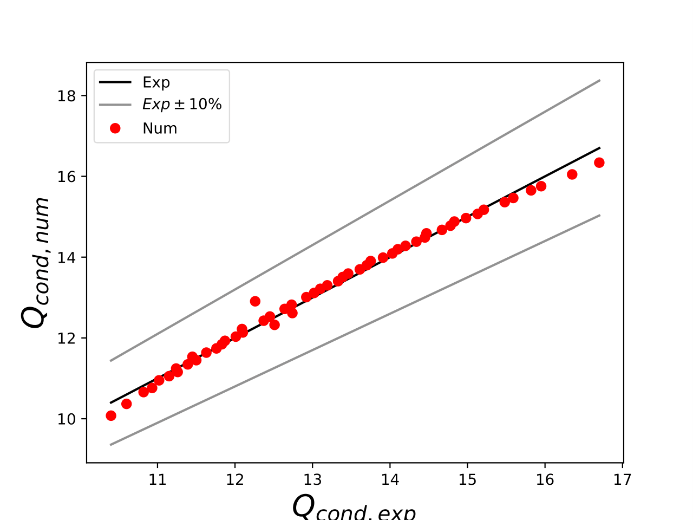
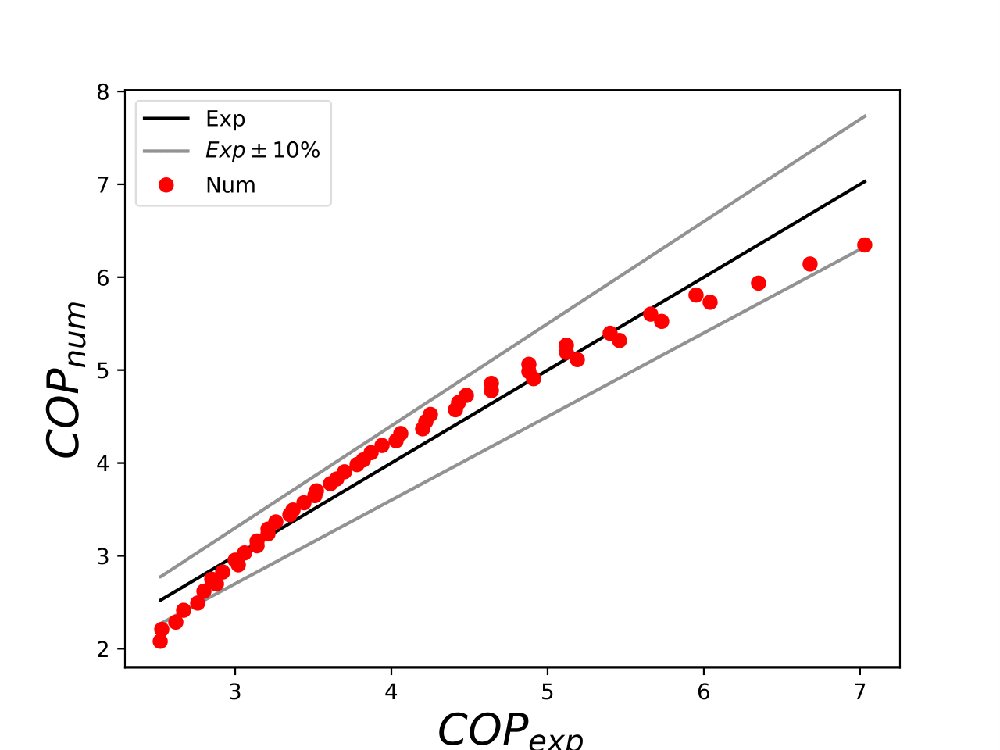
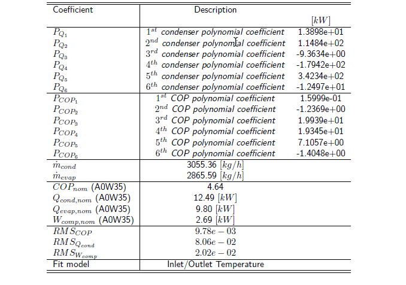

.. _energy_system_component_models:

Introduction
============

The optihood framework was implemented within this project and extended within the SFOE-sponsored project SolHOOD7. It is written in Python programming language and based on oemof (open energy modelling framework). In oemof, an energy system is defined as a combination of linear component models of different types namely, sources, transformers, sinks, and buses. The components models are linked together using flow objects which may have associated costs (optional) to formulate the target function to optimize. Then, Oemof makes use of pyomo, an open-source modelling language for optimization solutions, to define a MILP optimization problem. The framework optihood offers a flexible and easy-to-use environment with several useful features for a neighborhood beyond what oemof can provide. The basic construct of oemof is modified in a sense that the components are grouped by buildings and the results (time series of energy production/consumption, costs, emissions, etc.) can be obtained per building. 

Grid electricity, natural gas, or any other form of energy consumed by the system can be considered as energy sources. An energy source is modelled simply as a “Source” from oemof solph. An energy demand can be related to electricity, space heat and domestic hot water, and is modelled as a “Sink” from oemof solph. In terms of energy conversion and storage technologies, the following are presently implemented: air-source heat pump (ASHP), ground-source heat pump (GSHP), combined heating and power (CHP), solar thermal collector, PV, electric heating rod, gas boiler, electrical battery and thermal storage. 

To summarize, the technologies are classified in three categories:

- Energy inputs: all energy vectors that are energy sources for the systems, e.g. fuels, grid electricity, energy from the environment like solar radiation, etc.
- Energy converters: equipment that converts inputs into usable energy (heat or electricity) for the end consumers
- Energy storages: device to store electricity or heat locally in order to be consumed later.

.. image:: ./resources/energy_types.png
      :width: 800
      :alt: energy_types

Modelling of energy system components
=====================================

The energy system components can be classified into energy converters and storages. We use constant efficiency models for CHP, gas boiler and electric heating rods, where a fixed efficiency is pre-defined. These fixed efficiencies are defined by the user in the input scenario file. 

Heat pumps
----------

Heat pumps (ASHP and GSHP) are modelled based on a bi-quadratic polynomial fit of the  condenser heating power ($\dot{ q }_c$) and the electrical consumption power of the compressor ($\dot{w}_{cp}$)::

\begin{align}
    
    \dot{q}_c = bq_1 + bq_2 \cdot \bar{T}_{e,in} + bq_3 \cdot \bar{T}_{c,out} + bq_4 \cdot \bar{T}_{e,in} \cdot{\bar{T}_c,out} + bq_5 \cdot \bar{T}^2_{e,in} + bq_6 \\
    \dot{w}_{cp} = bp_1 + bp_2 \cdot \bar{T}_{e,in} + bp_3 \cdot \bar{T}_{c,out} + bp_4 \cdot \bar{T}_{e,in} \cdot \bar{T}_{c,out} + bp_5 \cdot \bar{T}^2_{e,in} + bp_6 \cdot \bar{T}^2_{c,out}

\end{align}

where, $T_{e,in}$ and $T_{c,out}$ are fluid temperatures at the inlet of the evaporator and the outlet of the condenser, respectively. $\bar{T}$ denotes the normalized temperature and is defined as $\bar{T} = \frac{T[^° C]}{273.15}. For the
solution of the system of equations the Brent solver is used [2]. The polynomial coefficients $b_{qi}$ and
$b_{pi}$ are calculated from the catalog heat pump data using the multidimensional least square fitting
algorithm of Scipy [3] in Python.
A reduced model can be proposed:

      \begin{align}
    
          \dot{q}_c = bq_1 + bq_2 \cdot \bar{T}_{e,in} + bq_3 \cdot \bar{T}_{c,out}  \\
          \dot{w}_{cp} = bp_1 + bp_2 \cdot \bar{T}_{e,in} + bp_3 \cdot \bar{T}_{c,out}
      \end{align}

However, this model is still non-linear. A way to overcome the non-linearity would be to fix the $\bar{T}_{c,out}$ to 35 °C and 65 °C, respectively, for space heating (SH) and domestic hot water (DHW).

.. image:: ./resources/HP_model_param.png
      :width: 800
      :alt: HP_model_param

Polynomial fit analysis for heat pump model

The model proposed would be to fix the Tcond,out in Eqs. (1) and (2) for different applications and
have a heat pump to target each demand. For example for a new building a heat pump will supply at
design conditions at 35°C/30°C. Thus we would use:

.. _equation1:

.. math::

\dot q_c &=& bq_1 + bq_2 \cdot \bar{T}_{e,in} + bq_3 \cdot \frac{35}{273.15}  + bq_4 \cdot \bar{T}_{e,in} \cdot \frac{35}{273.15} + bq_5 \cdot \bar{T}_{e,in}^2 + bq_6 \cdot \frac{35}{273.15}^2 

.. _equation2:

.. math::

\dot w_{cp} &=& bp_1 + bp_2 \cdot \bar{T}_{e,in} + bp_3 \cdot \frac{35}{273.15}  + bp_4 \cdot \bar{T}_{e,in} \cdot \frac{35}{273.15} + bp_5 \cdot \bar{T}_{e,in}^2 + bp_6 \cdot \frac{35}{273.15}^2 

The fitted data for the HP08L-M-BC air/water heat pump using the proposed approach described by
Eq. 5 and Eq. 6 is provided in Fig. 4 and Table 2, while the fitted heat pump coefficients are given in
Table 3. While, the fitted data for the ProDomo13-R410A brine/water heat pump using the proposed
approach described by Eq. 5 and Eq. 6 is provided in Fig. 5 and Table 4, while the fitted heat pump
coefficients are given in Table 5

Table 2: Differences between experiments and fitted data for the HP08L-M-BC air/water heat pump using :math:`\dot q_c &=& bq_1 + bq_2 \cdot \bar{T}_{e,in} + bq_3 \cdot \frac{35}{273.15}  + bq_4 \cdot \bar{T}_{e,in} \cdot \frac{35}{273.15} + bq_5 \cdot \bar{T}_{e,in}^2 + bq_6 \cdot \frac{35}{273.15}^2` and :math:`\dot w_{cp} &=& bp_1 + bp_2 \cdot \bar{T}_{e,in} + bp_3 \cdot \frac{35}{273.15}  + bp_4 \cdot \bar{T}_{e,in} \cdot \frac{35}{273.15} + bp_5 \cdot \bar{T}_{e,in}^2 + bp_6 \cdot \frac{35}{273.15}^2`. :math:`error=100 \cdot |\frac{Q_{exp}-Q_{num}}{Q_{exp}}|` and :math:`RMS = \sqrt { \sum{\frac{(Q_{exp}-Q_{num})^2}{n_p}} }` where $n_p$ is the number of data points.

.. image:: ./resources/HP_table2_new.png
      :width: 800
      :alt: HP_table2

Fitted coefficients for the HP08L-M-BC air/water heat pump using Eq. REF and Eq. REF

.. image:: ./resources/HP_table3.png
      :width: 800
      :alt: HP_table3

.. image:: ./resources/HP_table4.png
      :width: 800
      :alt: HP_table4

.. image:: ./resources/HP_figure_4_5.png
      :width: 800
      :alt: HP_figure_4_5

Other energy systems
--------------------

Solar thermal collectors and PV modules production profiles are pre-calculated before the optimization. For batteries, a simple model is used that accounts for fixed charging and discharging efficiencies and a loss parameter. For thermal storages, a stratified thermal storage model with two temperature zones is used.
