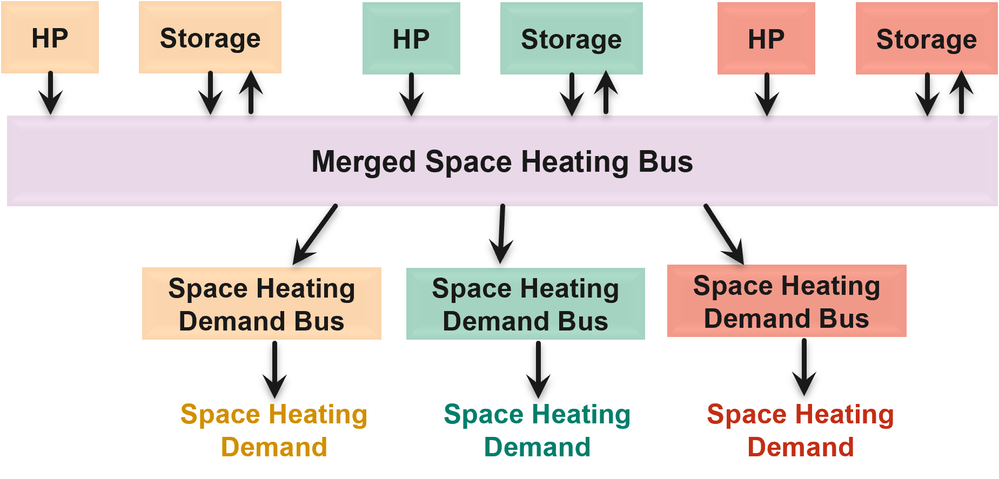

.. _energy_system_component_models:

Introduction to optihood
========================

optihood is based on `oemof <https://oemof.org/>`_ (open energy modelling framework), in particular oemof.solph and oemof.thermal packages. In oemof, an energy system is defined as a combination of linear component models of different types namely, sources, transformers, sinks, and buses. The components models are linked together using flow objects which may have associated costs (optional) to formulate the target function to optimize. Then, oemof makes use of pyomo, an open-source modelling language for optimization solutions, to define a MILP optimization problem. The framework optihood offers a flexible and easy-to-use environment with several useful features for a neighborhood beyond what oemof can provide. The basic construct of oemof is modified in a sense that the components are grouped by buildings and the results (time series of energy production/consumption, costs, emissions, etc.) can be obtained per building.

Grid electricity, natural gas, or any other form of energy consumed by the system can be considered as energy sources. An energy source is modelled simply as a “Source” from oemof solph. An energy demand can be related to electricity, space heat and domestic hot water, and is modelled as a “Sink” from oemof solph. In terms of energy conversion and storage technologies, the following are presently implemented: air-source heat pump (ASHP), ground-source heat pump (GSHP), combined heating and power (CHP), solar thermal collector, PV, electric heating rod, gas boiler, electrical battery and thermal storage. 

.. image:: ./resources/optihood_architecture.png
      :width: 800
      :alt: optihood_architecture

To summarize, the technologies are classified in three categories:

- Energy inputs: all energy vectors that are energy sources for the systems, e.g. fuels, grid electricity, energy from the environment like solar radiation, etc.
- Energy converters: equipment that converts inputs into usable energy (heat or electricity) for the end consumers
- Energy storages: device to store electricity or heat locally in order to be consumed later.

.. image:: ./resources/energy_types.png
      :width: 800
      :alt: energy_types

Energy system component models
-------------------------------

The energy system components can be classified into energy converters and storages. We use constant efficiency models for CHP, gas boiler and electric heating rods, where a fixed efficiency is pre-defined. These fixed efficiencies are defined by the user in the input scenario file. 

Heat pumps
^^^^^^^^^^

Heat pumps (ASHP and GSHP) are modelled based on a bi-quadratic polynomial fit of the  condenser heating power (:math:`\dot{ q }_c`) and the electrical consumption power of the compressor (:math:`\dot{w}_{cp}`):

.. math::

    &\dot{q}_c = bq_1 + bq_2 \cdot \bar{T}_{e,in} + bq_3 \cdot \bar{T}_{c,out} + bq_4 \cdot \bar{T}_{e,in} \cdot{\bar{T}_c,out} + bq_5 \cdot \bar{T}^2_{e,in} + bq_6 \\
    &\dot{w}_{cp} = bp_1 + bp_2 \cdot \bar{T}_{e,in} + bp_3 \cdot \bar{T}_{c,out} + bp_4 \cdot \bar{T}_{e,in} \cdot \bar{T}_{c,out} + bp_5 \cdot \bar{T}^2_{e,in} + bp_6 \cdot \bar{T}^2_{c,out}

where, :math:`T_{e,in}` and :math:`T_{c,out}` are fluid temperatures at the inlet of the evaporator and the outlet of the condenser, respectively. :math:`\bar{T}` denotes the normalized temperature and is defined as :math:`\bar{T} = \frac{T[^{\circ} \text{C}]}{273.15}`. For the
solution of the system of equations the Brent solver is used [1]. The polynomial coefficients :math:`b_{qi}` and
:math:`b_{pi}` are calculated from the catalog heat pump data using the multidimensional least square fitting
algorithm of Scipy [2] in Python.

Table 1: Parameters, inputs and outputs of heat pump model.

Polynomial fit analysis for heat pump model

.. image:: ./resources/R410A-predict-Cop-1.png
      :width: 600
      :alt: R410A-predict-Cop
Figure 1: Typical coefficient of performance map (COP) for a R410A heat pump obtained using the two equations above.

.. figure:: ./resources/R410A-Qcond-1.png
   :width: 400
   :alt: R410A-Qcond
Figure 2: Differences between experimental and fitted data using the full polynomial formulation from
the two equations above for condenser heat.

.. figure:: ./resources/R410A-COP-1.png
   :width: 400
   :alt: R410A-COP
Figure 3: Differences between experimental and fitted data using the full polynomial formulation from
the two equations above for coefficient of performance (COP).

However, this model is non-linear. A way to overcome the non-linearity would be to fix the :math:`\bar{T}_{c,out}` to 35 °C and 65 °C, respectively, for space heating (SH) and domestic hot water (DHW). Thus we would use for example:

.. math::

      \dot{q}_c = bq_1 + bq_2 \cdot \bar{T}_{e,in} + bq_3 \cdot \frac{35}{273.15}  + bq_4 \cdot \bar{T}_{e,in} \cdot \frac{35}{273.15} + bq_5 \cdot \bar{T}_{e,in}^2 + bq_6 \cdot \frac{35}{273.15}^2 

.. math::

      \dot{w}_{cp} = bp_1 + bp_2 \cdot \bar{T}_{e,in} + bp_3 \cdot \frac{35}{273.15}  + bp_4 \cdot \bar{T}_{e,in} \cdot \frac{35}{273.15} + bp_5 \cdot \bar{T}_{e,in}^2 + bp_6 \cdot \frac{35}{273.15}^2 

The fitted data for the HP08L-M-BC air/water heat pump using the proposed approach described by
the two equations above are provided in Fig. 4-5 and Table 2, while the fitted heat pump coefficients are given in
Table 3. While, the fitted data for the ProDomo13-R410A brine/water heat pump using the proposed
approach described by the two equations above are provided in Fig. 6-7 and Table 4, while the fitted heat pump
coefficients are given in Table 5.

Table 2: Differences between experiments and fitted data for the HP08L-M-BC air/water heat pump using the two equations above. :math:`error=100 \cdot |\frac{Q_{exp}-Q_{num}}{Q_{exp}}|` and :math:`RMS = \sqrt { \sum{\frac{(Q_{exp}-Q_{num})^2}{n_p}} }` where :math:`n_p` is the number of data points.

Table 3: Fitted coefficients for the HP08L-M-BC air/water heat pump using the two equations above.

.. image:: ./resources/HP_table3.png
      :width: 500
      :alt: HP_table3

Figure 4: Differences between experimental and fitted data of HP08L-M-BC air/water heat pump using
the proposed approach from the two equations above for coefficient of performance
(COP).

Figure 5: Differences between experimental and fitted data of HP08L-M-BC air/water heat pump using
the proposed approach from the two equations above for condenser heat.

.. image:: ./resources/ProDomo13-R410A-COP-1.png
      :width: 400
      :alt: ProDomo13-R410A-COP-1
Figure 6: Differences between experimental and fitted data of ProDomo13-R410A brine/water heat pump using
the proposed approach from the two equations above for coefficient of performance
(COP).

.. image:: ./resources/ProDomo13-R410A-Qcond-1.png
      :width: 400
      :alt: ProDomo13-R410A-Qcond-1
Figure 7: Differences between experimental and fitted data of ProDomo13-R410A brine/water heat pump using
the proposed approach from the two equations above for condenser heat.

Table 4: Differences between experiments and fitted data for the ProDomo13-R410A brine/water heat
pump using the two equations above. :math:`error=100 \cdot |\frac{Q_{exp}-Q_{num}}{Q_{exp}}|` and :math:`RMS = \sqrt { \sum{\frac{(Q_{exp}-Q_{num})^2}{n_p}} }` where :math:`n_p` is the number of data points.

Table 5: Fitted coefficients for the ProDomo13-R410A brine/water heat pump using the two equations above.

.. image:: ./resources/HP_table5.png
      :width: 600
      :alt: HP_table5

Solar thermal collector
^^^^^^^^^^^^^^^^^^^^^^^^

A module to calculate the usable heat of a flat plate collector is described in details in `Solar thermal collector <https://oemof-thermal.readthedocs.io/en/latest/solar_thermal_collector.html#solar-thermal-collector>`_.
The model for solar thermal collector is taken from the oemof thermal package.

PV
^^^

The installed PV provides electricity to the building during the irradiation hours. Along with the battery, the usual strategy is to store the PV surplus power in the battery to be consumed at later hours of the planning horizon. The maximum available power :math:`pv_t^{avail}` of the PV is a built function that depends on the PV cell temperature, the ambient temperature and the total solar horizontal irradiation. These formulas, as well as the decision variables and the characteristics of the PV are stated in the next Table.
PV modules production profiles are pre-calculated before the optimization. 

Two-zone thermal energy storage
^^^^^^^^^^^^^^^^^^^^^^^^^^^^^^^^

A simplified 2-zone-model of a stratified thermal energy storage is implemented and described indetails in `Stratified thermal storage <https://oemof-thermal.readthedocs.io/en/latest/stratified_thermal_storage.html>`_.
The model for stratified thermal storage is taken from the oemof thermal package.

Combined production transformer
^^^^^^^^^^^^^^^^^^^^^^^^^^^^^^^^

A new transformer called combined production transformer which extends the features of oemof “Transformer” was defined. Since some transformers like HP can have different efficiencies for SH and DHW production (DHW needs a higher temperature than SH), this transformer offers the possibility to consider those different efficiencies. It allows to produce both space heating (SH) and domestic hot water (DHW) during the same timestep while respecting the input/output balance constraint.

.. math::

    P_{input}(t) = \frac{P_{DHW}(t)}{\eta_{DHW}} + \frac{P_{SH}(t)}{\eta_{SH}}, \forall t

where, :math:`P` denotes the operating power for inputs (for example, electricity used by HP) and outputs (SH and DHW), :math:`\eta` denotes efficiency of the transformer and :math:`t` denotes the time step.
Physically the converters cannot supply both SH and DHW at the same time. However, if we consider a timestep of 1 hour it can be considered to be sub-divided into smaller intervals to produce SH and DHW both within 1 hour. The combined production transformer was used for the implementation of heat pumps (ASHP, GSHP), CHP, gas boiler and electric heating rod.

PVT collector
^^^^^^^^^^^^^^

PVT class was implemented within the converters module, which defines the energy conversion technologies
supported by optihood. The collector output is modelled based on the characteristic curve model reported
in the SwissEnergy sponsored project PVT Wrap-Up (Zenhäusern et al. (2017)). The thermal output of a
PVT collector, :math:`\dot{Q}`, highly depends on the surrounding environment and the operating conditions. The most
significant influencing factors are the solar irradiation per collector surface area (:math:`G`), ambient air temperature
(:math:`T_{amb}`) and the mean temperature of the collector fluid (:math:`T_m`). The characteristic equation of thermal output
of the PVT collector is given by:

.. math::

   \frac{\dot Q}{A} =(G - \frac{P_{el}^{DC}}{(\alpha \tau) \cdot A}) \cdot \eta_0 - a_1(T_m - T_{amb}) - a_2 (T_m - T_{amb})^2

where A stands for the gross area of the collector surface, :math:`P_{el}^{DC}` stands for the DC electrical output of the
collector, (\alpha \tau) is the transmission absorption product of the collector, :math:`\eta_0` is the maximum thermal efficiency,
:math:`a_1` is the linear heat loss coefficient and :math:`a_2` is the quadratic heat loss coefficient of the collector.
A corresponding label :math:`PVT` was added to the energy conversion technology processing function, to allow the
definition of a PVT collector in the input excel/config file while preparing the optimization problem.

Layered thermal energy storage and discrete temperature levels
^^^^^^^^^^^^^^^^^^^^^^^^^^^^^^^^^^^^^^^^^^^^^^^^^^^^^^^^^^^^^^^

A discretized thermal energy storage with several predefined discrete temperature levels was implemented.
Moreover, the heat production technologies such as heat pumps, CHP, solar thermal collectors, etc. were
extended to allow multiple output flows (at different temperature levels). It should be noted that the temperature
levels are predefined and each heat production technology, therefore, has a predefined hourly efficiency
related to a specific temperature level. The number of discrete temperature levels is parameterized and can be
defined in the input scenario excel file. In order to use discrete temperature levels, the ``temperatureLevels``
parameters has to be True when the ``EnergyNetwork`` class is instantiated::

      import EnergyNetworkGroup as EnergyNetwork

      #set a time period for the optimization problem
      TimePeriod = np.date_range("2021-01-01 00:00:00". "2021-12-31 23:00:00", freq = "60min"

      #create an energy network and set the network parameters from an excel file
      network = EnergyNetwork(timeperiod, temperatureLevels=True)

The discrete temperature levels defined in the input scenario file, set the temperatures of the output
flows of the heat conversion technologies. Depending on the time resolution of the optimization problem, it
may not be acceptable for a heat conversion technology to produce heat at more than one temperature levels
in a single time step. Therefore, ``limit_active_flow_count`` constraint of oemof solph package (Hilpert
et al. (2018)) was used to permit only one of the heat output flows to remain active at a given time step.
A class ``ThermalStorageTemperatureLevels`` was developed to represent a discretized thermal energy storage.
The model of a layered thermal energy storage is a combination of dual temperature zone storages from
oemof thermal python package (Hilpert et al. (2018)). The dual temperature zone storages include predefined
calculations for top/bottom and lateral surface losses. While the lateral surface losses are preserved for the
storage layers at each temperature level, the top and bottom surface losses should only be considered for the topmost (i.e. at the highest temperature level) and the lowest (i.e. at the lowest temperature) layers. The fixed
one-time investment cost of the discretized thermal energy storage should be added to the objective function
only once (instead of being added for each layer separately). These functionalities are implemented within the
``ThermalStorageTemperatureLevels`` class. Moreover, the total storage volume :math:`V_{stor}` is calculated as the
sum of individual layer volumes (:math:`v_i`), as follows:

.. math::

      \sum_{i=1}^n v_i = V_{stor}

where :math:`n` denotes the number of discrete temperature levels.

A constraint called ``multiTemperatureStorageCapacityConstaint`` was developed to implement the following
rule on the storage volume capacity:

.. math::

      V_{stor,min} \leq V_{stor} \leq V_{stor,max}

where :math:`V_{stor,max}` and :math:`V_{stor,min}` represent the minimum and the maximum limits for the storage volume.
The Figure below shows a graphical representation of a layered thermal energy storage with three discrete temperature
levels. The DHW demand is met using the topmost temperature level at 65 °C i.e. highest temperature, while
the lowest temperature level at 35 °C is used to cover the SH demand. A rule for charging the thermal energy
storage was implemented, such that the energy inflow at a given storage layer (except the lowest layer), equals
the energy outflow from the preceding storage layer. Therefore, in order to supply thermal energy at 50 °C
to the storage, the same volume added at the 50 °C layer should be displaced from layer below, i.e. from the
35 °C storage level (as shown in Figure 11). This means that the energy conversion technologies can heat
water from 35 °C to 50 °C and from 50 °C to 65 °C, in that order.

.. image:: ./resources/layered_storage.png
      :width: 400
      :alt: layered_storage

Thermal and electrical links
-----------------------------

In order to allow buildings to share space heat and domestic hot water production, thermal grids were implemented.
A new component was implemented connecting all the relevant input/output flows of the buildings. A new component class, called Link, extending those already available in oemof,
was defined with a new constraint group. The implementation of electrical links was also updated. A
link is now modeled as a new component (does not exist in oemof) where all the relevant input/output flows
of the buildings connect. The new implementation of links is depicted in the next Figure.

The implementation of links adds complexity to the optimization problem and affects the convergence
speed. When the optimizer needs to decide whether to connect the buildings (and which ones to connect),
each output of a link adds a binary variable into the problem, which exponentially increases the computation
time as the number of buildings (i.e. number of outputs of each link) and the number of links (electrical, space
heating, domestic hot water) increase. In order to improve the speed of optimization, an option to merge the
respective buses, i.e. energy flows (electricity, space heating and domestic hot water), of all the buildings to
be linked was added into the framework. An example of a merged space heating bus for a scenario with three
buildings is shown in the next Figure. This option can be used to perform optimization in two steps. In the first
step, the implementation of links shown in the previous Figure is used, which allows the optimizer to select whether
connecting the buildings is the best solution or not (although takes longer). Once it has been established that
connecting the buildings is the best solution, the new option to merge buses (see next Figure) is used to produce
additional optimizations results faster.

Building model
---------------

A linear RC building model is presently under-development to replace the static space heating demand profiles. A building
model is a grey-box model which is often used to depict the thermal behaviour of a building in a simplified manner. It is
implemented as a custom sink component along with a set of new constraints.

.. image:: ./resources/building_model_oemof.png
      :width: 400
      :alt: building_model_oemof

The specific building model implemented in optihood was proposed and validated in [3] and is characterized by three thermal
spaces:

- wall and building mass
- indoor air
- distribution system

Each thermal space is at a certain temperature at a particular timestep. Moreover, each thermal space has two key parameters
which represent the thermal resistance and thermal capacity. The temperature of each thermal space is influenced by the
temperature of adjascent thermal spaces, heat flow, internal heat gains and ambient weather conditions.

.. image:: ./resources/building_model.png
      :width: 600
      :alt: building_model

The parameters and variables of the RC model are described below:

+----------------------------------------------------------------------------------------------------------------------+
| **Parameters**                                                                                                       |
+---------------------------+------------------------------------------------------------------------------------------+
| :math:`R_{ind}`           |  Thermal resistance between indoor and wall states [K/kW]                                |
+---------------------------+------------------------------------------------------------------------------------------+
| :math:`R_{wall}`          |  Thermal resistance between wall state and outside [K/kW]                                |
+---------------------------+------------------------------------------------------------------------------------------+
| :math:`R_{dis}`           |  Thermal resistance between indoor and distribution system states [K/kW]                 |
+---------------------------+------------------------------------------------------------------------------------------+
| :math:`C_{ind}`           |  Thermal capacity of the indoor air state [kWh/K]                                        |
+---------------------------+------------------------------------------------------------------------------------------+
| :math:`C_{wall}`          |  Thermal capacity of the wall state [kWh/K]                                              |
+---------------------------+------------------------------------------------------------------------------------------+
| :math:`C_{dis}`           |  Thermal capacity of the distribution system state [kWh/K]                               |
+---------------------------+------------------------------------------------------------------------------------------+
| :math:`gA`                |  Aperture area of the windows [:math:`m^2`]                                              |
+---------------------------+------------------------------------------------------------------------------------------+
| :math:`Q^{dis}_{min}`     |  Minimum operating power from the tank to the distribution system [kW]                   |
+---------------------------+------------------------------------------------------------------------------------------+
| :math:`Q^{dis}_{max}`     |  Maximum operating power from the tank to the distribution system [kW]                   |
+---------------------------+------------------------------------------------------------------------------------------+
| :math:`T^{ind}_{min}`     |  Indoor minimum comfort temperature [°C]                                                 |
+---------------------------+------------------------------------------------------------------------------------------+
| :math:`T^{ind}_{max}`     |  Indoor maximum comfort temperature [°C]                                                 |
+---------------------------+------------------------------------------------------------------------------------------+
| **Exogenous input parameters**                                                                                       |
+---------------------------+------------------------------------------------------------------------------------------+
| :math:`T^{amb}_{t}`       |  Ambient outside air temperature at :math:`t^{th}` timestep [°C]                         |
+---------------------------+------------------------------------------------------------------------------------------+
| :math:`I^{H}_{t}`         |  Total horizontal irradiation at :math:`t^{th}` timestep [kW/:math:`m^2`]                |
+---------------------------+------------------------------------------------------------------------------------------+
| :math:`Q^{occ}_{t}`       |  Internal heat gains from occupants at :math:`t^{th}` timestep [kW]                      |
+---------------------------+------------------------------------------------------------------------------------------+
| **Boundary parameters**                                                                                              |
+---------------------------+------------------------------------------------------------------------------------------+
| :math:`T^{ind}_{init}`    |  Indoor initial temperature [°C]                                                         |
+---------------------------+------------------------------------------------------------------------------------------+
| :math:`T^{wall}_{init}`   |  Wall initial temperature [°C]                                                           |
+---------------------------+------------------------------------------------------------------------------------------+
| :math:`T^{dis}_{init}`    |  Distribution system initial temperature [°C]                                            |
+---------------------------+------------------------------------------------------------------------------------------+
| **State variables**                                                                                                  |
+---------------------------+------------------------------------------------------------------------------------------+
| :math:`T^{ind}_t`         |  Indoor temperature at :math:`t^{th}` timestep [°C]                                      |
+---------------------------+------------------------------------------------------------------------------------------+
| :math:`T^{wall}_t`        |  Wall temperature at :math:`t^{th}` timestep [°C]                                        |
+---------------------------+------------------------------------------------------------------------------------------+
| :math:`T^{dis}_t`         |  Distribution system temperature at :math:`t^{th}` timestep [°C]                         |
+---------------------------+------------------------------------------------------------------------------------------+
| :math:`\epsilon^{ind}_t`  | Violation of indoor comfort temperature range at :math:`t^{th}` timestep [°C]            |
+---------------------------+------------------------------------------------------------------------------------------+
| :math:`\delta^{ind}_t`    |  Violation of indoor final temperature requirement [°C]                                  |
+---------------------------+------------------------------------------------------------------------------------------+
| :math:`P^{dis}_t`         |  Electric consumption of the distribution system                                         |
+---------------------------+------------------------------------------------------------------------------------------+
| **Decision variable**                                                                                                |
+---------------------------+------------------------------------------------------------------------------------------+
| :math:`Q^{dis}_t`         | Heating power from the tank to the distribution system at :math:`t^{th}` timestep [kW]   |
+---------------------------+------------------------------------------------------------------------------------------+

The state space equations of the building model are:

.. image:: ./resources/state_space_eq.png
      :width: 600
      :alt: state_space_eq
      :align: center

| The final constraints of the building model are:

.. image:: ./resources/Constraint1.png
      :width: 520
      :alt: constraint1
      :align: center

.. image:: ./resources/Constraint2.png
      :width: 140
      :alt: constraint2
      :align: center

.. image:: ./resources/Constraint3.png
      :width: 300
      :alt: constraint3
      :align: center

.. image:: ./resources/Constraint4.png
      :width: 200
      :alt: constraint4
      :align: center

.. image:: ./resources/Constraint5.png
      :width: 400
      :alt: constraint5
      :align: center

| [1] M Galassi, J Davies, B Gough, G Jungman, M Booth, and F Rossi. GNU Scientific Library Reference Manual. John Wiley & Sons, 2nd edition, 2003.
| [2] Eric Jones, Travis Oliphant, Pearu Peterson, et al. SciPy: Open source scientific tools for Python, 2001.
| [3] T. Péan, R. Costa Castelló y J. Salom, Price and carbon-based energy flexibility of residential heating and cooling loads using model predictive control, Sustainable Cities and Society, vol. 50, 2019.

