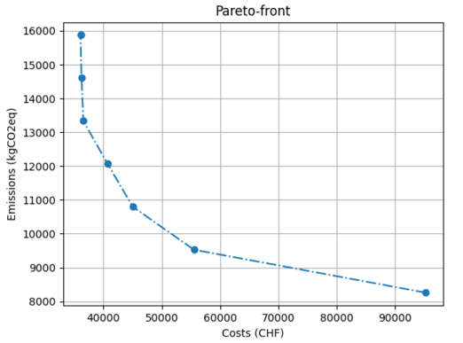

.. _optimizing_the_energy_network:

Optimizing the energy network
=============================

Once the energy system has been defined as an object of the EnergyNetworkIndiv class or the EnergyNetworkGroup class
and the model components (and parameters) have been set from the input excel file, the network object could then be
optimized::

    envImpact, capacitiesTransformers, capacitiesStorages = network.optimize(solver='gurobi',
                                                                           envImpactlimit=envImpactlimit,
                                                                           clusterSize=clusterSize,
                                                                           options=optimizationOptions,
                                                                           mergeLinkBuses=mergeLinkBuses)

The first parameter solver specifies the name of solver to be used for optimization. ``solver`` could take the values
``gurobi``, ``cbc``, ``cplex`` or ``glpk``. ``envImpactlimit`` denotes the maximum limit for environmental impact. This parameter
becomes relevant in case of multi-objective optimization and would be described in the later sections. For single-objective
optimization set this parameter to a significantly high value which would never be reached (For example: 10^6). ``clusterSize``
is the parameter related to clustered days (if defined). This is an optional parameter and is required only if clustered
days are used. ``options`` specifies the command line parameters to be passed to the selected solver. This parameter is
described further in the following section. The ``mergeLinkBuses`` defines whether or not the buses of the different buildings should be merged (set to False if not given). The ``optimize`` function returns the environmental impact of the optimized energy
model, the capacities selected for energy transformers (or converters such as CHP, heat pump, etc.) and for the storages
in the optimized energy network model.

Optimization options
--------------------

The ``options`` parameter of the optimize function allows passing command line options to the solver. The optimization options
could be passed as a dictionary indexed by the solver name. For example::

    # solver specific command line options
    optimizationOptions = {
        "gurobi": {
            "BarConvTol": 0.5,
            # The barrier solver terminates when the relative difference between the primal and dual objective values is less than the specified tolerance (with a GRB_OPTIMAL status)
            "OptimalityTol": 1e-4,
            # Reduced costs must all be smaller than OptimalityTol in the improving direction in order for a model to be declared optimal
            "MIPGap": 1e-2,
            # Relative Tolerance between the best integer objective and the objective of the best node remaining
            "MIPFocus": 2
            # 1 feasible solution quickly. 2 proving optimality. 3 if the best objective bound is moving very slowly/focus on the bound
            # "Cutoff": #Indicates that you aren't interested in solutions whose objective values are worse than the specified value., could be dynamically be used in moo
        },
        "cbc": {"tee": False}
    }

The options for a new solver could be added as a new item in this dictionary in the form::

    solver_name:{option_name: option_value}

where ``solver_name`` specifies the name of the solver, ``option_name`` and ``option_value`` are the name and value, respectively
of the command line option.

For more details on the different command line options which could be passed to the solver, we recommend you to have a
look at the documentation of the respective solver.

Dispatch optimization
----------------------

The dispatch optimization is an option that enables to optimize the size of the used technologies but does not decide whether to use them or not (it supposes that they are already installed). In this way, it is opposite to the investment optimization where the different available technologies are compared and then selected based on the optimized scenario.

Single-objective optimization
-----------------------------

Single-objective optimization can be performed easily by calling the ``optimize`` function of the EnergyNetworkIndiv or
EnergyNetworkGroup class once the energy network has been defined. The optimization problem and the energy network should
be defined using the input excel file. The target for single-objective optimization could be specified at this stage as
a parameter passed in the ``setFromExcel`` function::

   network.setFromExcel(inputExcelFilePath, numberOfBuildings, clusterSize, opt, mergeLinkBuses, dispatchMode)

The parameter ``dispatchMode`` is used to decide whether or not the dispatch optimization is applied (set to False if not given). The parameter ``opt`` could be set to either ``'costs'`` or ``'env'`` for optimization based on cost or environmental impact,
respectively. The respective data related to costs/environmental impact of the energy resources and the available energy
conversion and storage technologies should be given in the appropriate sections of the input excel file.

For more details on the ``setFromExcel`` function and the structure of the input excel file, have a look at :ref:`defining_an_energy_network`.

Multi-objective optimization
----------------------------

Multi-objective optimization can be performed as multiple single objective optimizations. At present, the two supported
target objectives are ``'costs'`` (total cost) and ``'env'`` (environmental emission). The first optimization would then be for
cost minimization and the second for the minimization of emissions, which would give the two extremes i.e. cost-optimum
solution and environmental optimum solution. And then, more solutions are obtained between the cost and environmental
optimum, these optimizations are a minimization of the cost subject to a constraint on the environmental criteria (epsilon
constraint method). The speed of optimization would be greatly affected by the number of optimizations to be performed.

The results from multi-objective optimization can be visualized using a pareto front.

For more information on how to work with multi-objective optimization go through the `example <https://github.com/SPF-OST/optihood/blob/main/data/examples/multi_objective_optimization.py>`_.

Clustering
----------

Clustering feature allows the users to improve the optimization speed by specifying a set of dates which could be considered
representative of the whole year (or the entire duration of the analysis). For example: four typical days could be selected
, one representing each season, and optihood would then provide the optimal design plan of the energy network based on these
days. Since the time resolution of the optimization problem would be much lower than simulating the whole year, the speed
of optimization is much faster when clustering is used.

Any clustering method (for example K-means clustering) can be chosen by the user and the results could be fed to optihood
for faster optimization. Note that in optihood one could use the results from clustering (which is to be done independently)
but the implementation of the clustering method itself is not a part of the optihood framework. The following results are
required from the clustering algorithm:

- Number of clusters
- Days of year representing each cluster
- Number of days in each cluster

In order to use the clustering feature, first a dictionary containing one item for each cluster, where keys and values are
the cluster's representative date and number of days, respectively, should be defined::

    cluster = {"2018-07-30": 26,
               "2018-02-03": 44,
               "2018-07-23": 32,
               "2018-09-18": 28,
               "2018-04-15": 22,
               "2018-10-01": 32,
               "2018-11-04": 32,
               "2018-10-11": 37,
               "2018-01-24": 15,
               "2018-08-18": 26,
               "2018-05-28": 23,
               "2018-02-06": 48}

Here, the days of the year have been represented using 12 clusters, where the first cluster consists of 26 days and is
represented by the date 30 June 2018.

This dictionary should be passed in the ``setFromExcel`` and ``optimize`` functions of the EnergyNetwork class::

    # set a time period for the optimization problem according to the number of clusers
    network = EnergyNetwork(pd.date_range("2018-01-01 00:00:00", "2018-01-12 23:00:00", freq="60min"), temperatureSH, temperatureDHW)

    # pass the dictionary defining the clusters to setFromExcel function
    network.setFromExcel("scenario.xls", numberOfBuildings=4, clusterSize=cluster, opt="costs")

    # pass the dictionary defining the clusters to optimize function
    envImpact, capacitiesTransformers, capacitiesStorages = network.optimize(solver='gurobi', clusterSize=cluster)

Note that the time period would need to be adjusted to include the timesteps corresponding to 12 days (12 x 24 = 288 timesteps
if hourly resolution is considered). Try the example on `selective days clustering <https://github.com/SPF-OST/optihood/blob/main/data/examples/selective_days_clustering.py>`_
for a better grasp.
