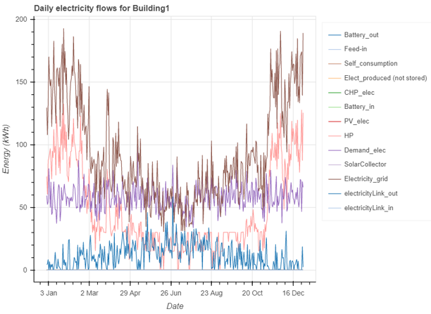
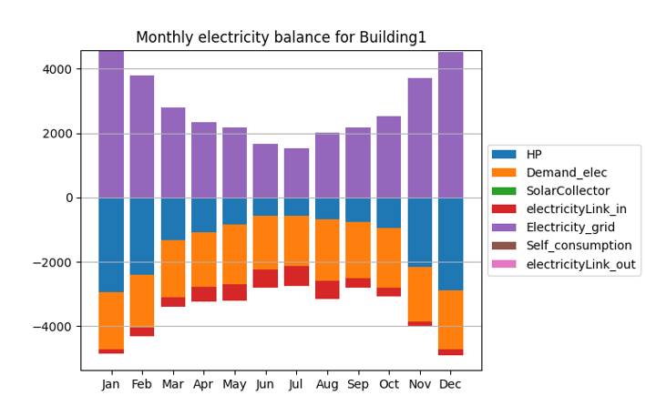

.. _processing_results:

Processing results
===================

Once the energy network has been optimized, the next step is to collect and visualize the results. The results can be saved
into an excel file so that they could be analysed later without the need to perform optimization again.

Moreover, optihood features several useful plotting methods for visualizing the selected technologies, detailed energy
flows and energy balance across the network.

Saving the results
-------------------

The optimization results can be saved into an excel file using the ``exportToExcel`` function of the EnergyNetwork class::

    # save results
    network.exportToExcel("results.xlsx")

The absolute path of the results excel file should be specified in ``exportToExcel`` function call.

Moreover, the following additional functions could be used to print some of the optimization results such as the capacities
selected by the optimizer for different components, total cost and environmental impact of the energy network::

    network.printInvestedCapacities(capacitiesTransformers, capacitiesStorages)
    network.printCosts()
    network.printEnvImpacts()

``capacitiesTransformers`` and ``capacitiesStorages`` are returned by the optimize function of the EnergyNetwork class (For
more details look at :ref:`optimizing_the_energy_network`).

Result visualization
--------------------

The results can be visualized at different levels of detail, for example a sankey diagram of the energy network summarizes
the capacities of the technologies selected and the annual energy flows between different components, while a detailed plot
could be made for visualizing the hourly electricity flows to/from Building 1.

To view the sankey diagram summarizing the optimization results, the plotting functions defined in ``optihood.plot_sankey``
should first be imported. ``plot`` function could then be used to obtain the interactive sankey diagram::

    # import plotting methods for Sankey
    import optihood.plot_sankey as snk

    ...

    numberOfBuildings = 4

    ...

    UseLabelDict = True     # a dictionary defining the labels to be used for different flows
    snk.plot("results.xlsx", "sankey.html", numberOfBuildings, UseLabelDict)

The ``plot`` function requires four parameters: the absolute path (including filename) of the results excel file, filename for
the sankey diagram, number of buildings and a boolean specifying whether or not the label dictionary should be used. The label
dictionary is defined in `labelDict.py <https://github.com/SPF-OST/optihood/blob/main/optihood/labelDict.py>`_. Note that
if ``useLabelDict`` is set to True, the label for each flow should be defined in labelDict.py, otherwise there will be an error.

.. image:: ./resources/sankey.png
      :width: 600
      :alt: sankey

The detailed energy flows can be visualized using the ``plot_functions`` library of optihood::

    # import the plot_functions library
    import optihood.plot_functions as fnc

    ...

    plotLevel = "allMonths"
    plotType = "bokeh"
    flowType = "electricity"

    fnc.plot("results.xlsx", figureFolderName, plotLevel, plotType, flowType)

optihood provides two types of detailed plots: interactive bokeh plots for visualizing the energy flows and the monthly
balance plots to check the energy balance across each flow. Accordingly, ``plotType`` can be selected as either ``'bokeh'`` or
``'energy balance'``. ``plotLevel`` can be set to either ``'allMonths'`` (for the entire year) or a specific month (three letter
abbreviation of the month, example: 'Jan', 'Feb', 'Mar', etc.) or a specific date in the format 'YYYY-MM-DD'. Note that
if the ``plotType`` is ``'energy balance'``, the ``plotLevel`` should be set to ``'allMonths'`` since the energy balance is made only
at a monthly level. The interactive bokeh plots are illustrated at both hourly and daily resolutions. ``flowType`` could be
set to ``'all'``, ``'electricity'``, ``'space heat'`` or ``'domestic hot water'`` to plot the respective energy flow.
``figureFolderName`` is the path of the folder where the figures would be saved.

Moreover, the monthly energy balance could be checked for each flow.

