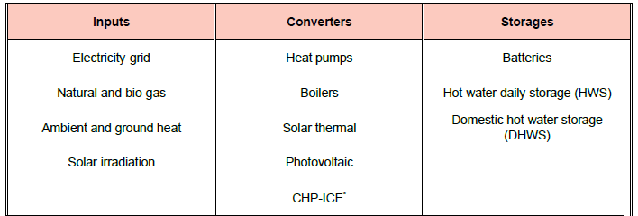

The technologies are classified in three categories:

- Energy inputs: all energy vectors that are energy sources for the systems, e.g. fuels, grid electricity, energy from the environment like solar radiation, etc.
- Energy converters: equipment that converts inputs into usable energy (heat or electricity) for the end consumers
- Energy storages: device to store electricity or heat locally in order to be consumed later.

Modelling of energy system components
--------------------

The energy system components can be classified into energy converters and storages. We use constant efficiency models for CHP, gas boiler and electric heating rods, where a fixed efficiency is pre-defined. Heat pumps (ASHP and GSHP) are modelled based on a bi-quadratic polynomial fit of the  condenser heating power ($\dot{ q }_c$) and the electrical consumption power of the compressor ($\dot{w}_{cp}) proposed by REF.

\begin{align}
    
    \dot{q}_c = bq_1 + bq_2 \cdot \bar{T}_{e,in} + bq_3 \cdot \bar{T}_{c,out} + bq_4 \cdot \bar{T}_{e,in} \cdot{\bar{T}_c,out} + bq_5 \cdot \bar{T}^2_{e,in} + bq_6 \\
    \dot{w}_{cp} = bp_1 + bp_2 \cdot \bar{T}_{e,in} + bp_3 \cdot \bar{T}_{c,out} + bp_4 \cdot \bar{T}_{e,in} \cdot \bar{T}_{c,out} + bp_5 \cdot \bar{T}^2_{e,in} + bp_6 \cdot \bar{T}^2_{c,out}

\end{align}

where, $T_{e,in}$ and $T_{c,out}$ are fluid temperatures at the inlet of the evaporator and the outlet of the condenser, respectively. $\bar{T}$ denotes the normalized temperature and is defined as $\bar{T} = \frac{T[^° C]}{273.15}. $bq_i$ and $bp_i$ are the polynomial coefficients calculated from the catalog heat pump data using multidimensional least square fitting. The condenser fluid outlet temperature $T_{c,out}$ was fixed to 35 °C and 65 °C, respectively, for space heating and domestic hot water.

Solar thermal collectors and PV modules production profiles are pre-calculated before the optimization. For batteries, a simple model is used that accounts for fixed charging and discharging efficiencies and a loss parameter. For thermal storages, a stratified thermal storage model with two temperature zones is used.
